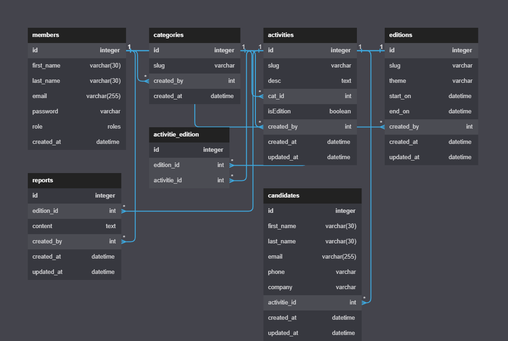

# Projet SQL - Benin DNS Forum

Ce projet SQL est destiné à la création et à la gestion d'une base de données pour le Benin DNS Forum. Il comprend plusieurs tables qui stockent les informations ainsi que des données fictives relatives aux activités, aux éditions, aux candidats, aux catégories, aux membres et aux rapports du forum. Voici le dictionnaire des données des differentes tables :

## Table `members`

C'est la table stockant les informations des membres du Benin DNS Forum

| Colonne      | Description                                  |
| ------------ | -------------------------------------------- |
| `id`         | Identifiant du membre (clé primaire)         |
| `first_name` | Prénom du membre                             |
| `last_name`  | Nom de famille du membre                     |
| `email`      | Adresse e-mail du membre                     |
| `password`   | Mot de passe du membre                       |
| `role`       | Rôle du membre (admin, standard, moderateur) |
| `created_at` | Date et heure de création du membre          |

## Table `categories`

C'est la table stockant les différentes catégories des activités

| Colonne      | Description                                          |
| ------------ | ---------------------------------------------------- |
| `id`         | Identifiant de la catégorie (clé primaire)           |
| `slug`       | Titre de la catégorie                                |
| `created_by` | Identifiant de l'utilisateur ayant créé la catégorie |
| `created_at` | Date et heure de création de la catégorie            |

## Table `activities`

C'est la table stockant les informations des activités au Benin DNS Forum

| Colonne      | Description                                                       |
| ------------ | ----------------------------------------------------------------- |
| `id`         | Identifiant de l'activité (clé primaire)                          |
| `slug`       | Titre ou thème de l'activité                                      |
| `desc`       | Description de l'activité                                         |
| `cat_id`     | Identifiant de la catégorie associée à l'activité                 |
| `isEdition`  | Indicateur indiquant si l'activité est une édition (1) ou non (0) |
| `created_by` | Identifiant de l'utilisateur ayant créé l'activité                |
| `created_at` | Date et heure de création de l'activité                           |
| `updated_at` | Date et heure de mise à jour de l'activité                        |

## Table `editions`

C'est la table stockant les informations de lancement de chaque edition du Benin DNS Forum

| Colonne      | Description                                       |
| ------------ | ------------------------------------------------- |
| `id`         | Identifiant de l'édition (clé primaire)           |
| `slug`       | Nom de l'édition du forum                         |
| `theme`      | Thème de l'édition du forum                       |
| `start_on`   | Date et heure de début de l'édition               |
| `end_on`     | Date et heure de fin de l'édition                 |
| `created_by` | Identifiant de l'utilisateur ayant créé l'édition |
| `created_at` | Date et heure de création de l'édition            |
| `updated_at` | Date et heure de mise à jour de l'édition         |

## Table `reports`

C'est la table stockant les rapports de chaque editions du Benin DNS Forum

| Colonne       | Description                                   |
| ------------- | --------------------------------------------- |
| `id`          | Identifiant du rapport (clé primaire)         |
| `activity_id` | Identifiant de l'activité associée au rapport |
| `member_id`   | Identifiant du membre ayant généré le rapport |
| `description` | Description du rapport                        |
| `created_at`  | Date et heure de création du rapport          |
| `updated_at`  | Date et heure de mise à jour du rapport       |

## Table `activitie_edition`

C'est la table fessant le lien entre une activité et une edition

| Colonne        | Description                                                                 |
| -------------- | --------------------------------------------------------------------------- |
| `id`           | Identifiant de la relation entre une activité et une édition (clé primaire) |
| `edition_id`   | Identifiant de l'édition associée                                           |
| `activitie_id` | Identifiant de l'activité associée                                          |

## Table `candidates`

C'est la table stockant les informations des candidats potentiels du Benin DNS Forum par ses activités

| Colonne        | Description                                                    |
| -------------- | -------------------------------------------------------------- |
| `id`           | Identifiant du candidat (clé primaire)                         |
| `first_name`   | Prénom du candidat                                             |
| `last_name`    | Nom de famille du candidat                                     |
| `email`        | Adresse e-mail du candidat                                     |
| `phone`        | Numéro de téléphone du candidat                                |
| `company`      | Nom de l'entreprise du candidat                                |
| `activitie_id` | Identifiant de l'activité à laquelle le candidat veut postuler |
| `created_at`   | Date et heure de création du candidat                          |
| `updated_at`   | Date et heure de mise à jour du candidat                       |

## Le modèle MCD

## License

Ce projet est libre d'édition et de répresentation uniqument aux membres du groupes de travail avec qui le projet est élaboré.